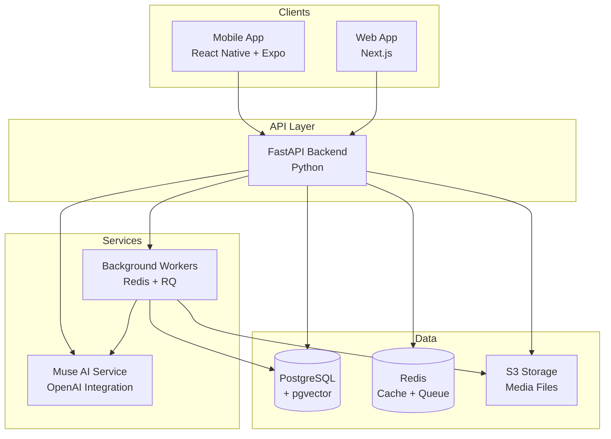

# Design Document: Chapters MVP

## Overview

Chapters is a calm, intentional social platform that reimagines social media through the metaphor of books and reading. The system architecture prioritizes depth over dopamine, reflection over reaction, and meaningful connection over viral engagement.

The platform consists of three primary client applications (mobile React Native app, Next.js web app, and future desktop clients) communicating with a Python FastAPI backend. The backend orchestrates data persistence (PostgreSQL with pgvector), media storage (S3-compatible), background job processing (Redis + RQ), and AI services (Muse).

### Core Design Principles

1. **Finite by Design**: No infinite scrolling, no endless feeds. All content is presented in bounded, page-based formats.
2. **Intentional Publishing**: The Open Pages system enforces thoughtful posting through daily allowances.
3. **Privacy First**: All creative work starts private in Study; publishing is an explicit choice.
4. **AI as Companion**: Muse assists but never overrides; all AI features are opt-in and respectful.
5. **Calm Engagement**: Metrics exist but don't dominate; no trending, no leaderboards, no streak pressure.

## Architecture

### High-Level System Architecture



### Technology Stack

**Backend**
- Language: Python 3.11+
- Framework: FastAPI
- ORM: SQLAlchemy with Alembic migrations
- Database: PostgreSQL 15+ with pgvector extension
- Cache & Queue: Redis 7+
- Background Jobs: RQ (Redis Queue)
- Storage: S3-compatible (Cloudflare R2 or AWS S3)
- AI: OpenAI API (GPT-4, DALL-E 3, text-embedding-3-small)

**Mobile (Primary Client)**
- Framework: React Native
- Tooling: Expo
- State Management: React Query + Zustand
- Animations: Reanimated 3
- Deployment: Expo EAS

**Web**
- Framework: Next.js 14 (App Router)
- Styling: Tailwind CSS
- Components: shadcn/ui
- Animations: Framer Motion
- Deployment: Netlify

**Infrastructure**
- Backend Hosting: Render
- Database: Render Managed PostgreSQL
- Web Hosting: Netlify
- Mobile Builds: Expo EAS
- Media Storage: Cloudflare R2
- Monitoring: Sentry

## Components and Interfaces

### Backend Module Structure

The FastAPI backend is organized into domain modules:

```
backend/
├── app/
│   ├── main.py                 # FastAPI app initialization
│   ├── config.py               # Configuration management
│   ├── dependencies.py         # Shared dependencies
│   │
│   ├── auth/                   # Authentication & authorization
│   │   ├── router.py
│   │   ├── models.py
│   │   ├── schemas.py
│   │   └── service.py
│   │
│   ├── books/                  # User profiles (Books)
│   │   ├── router.py
│   │   ├── models.py
│   │   ├── schemas.py
│   │   └── service.py
│   │
│   ├── chapters/               # Chapter posts
│   │   ├── router.py
│   │   ├── models.py
│   │   ├── schemas.py
│   │   └── service.py
│   │
│   ├── study/                  # Drafts, notes, footnotes
│   │   ├── router.py
│   │   ├── models.py
│   │   ├── schemas.py
│   │   └── service.py
│   │
│   ├── library/                # Bookshelf, feeds, quiet picks
│   │   ├── router.py
│   │   ├── schemas.py
│   │   └── service.py
│   │
│   ├── margins/                # Comments
│   │   ├── router.py
│   │   ├── models.py
│   │   ├── schemas.py
│   │   └── service.py
│   │
│   ├── engagement/             # Hearts, follows, bookmarks
│   │   ├── router.py
│   │   ├── models.py
│   │   ├── schemas.py
│   │   └── service.py
│   │
│   ├── muse/                   # AI companion service
│   │   ├── router.py
│   │   ├── service.py
│   │   ├── prompts.py
│   │   └── embeddings.py
│   │
│   ├── between_the_lines/      # Private connections
│   │   ├── router.py
│   │   ├── models.py
│   │   ├── schemas.py
│   │   └── service.py
│   │
│   ├── moderation/             # Blocks, reports
│   │   ├── router.py
│   │   ├── models.py
│   │   ├── schemas.py
│   │   └── service.py
│   │
│   ├── storage/                # S3 integration
│   │   └── service.py
│   │
│   └── workers/                # Background job definitions
│       ├── cover_generation.py
│       ├── embeddings.py
│       └── notifications.py
```

### Core API Endpoints

#### Authentication
- `POST /auth/register` - Create new account
- `POST /auth/login` - Authenticate user
- `POST /auth/refresh` - Refresh access token
- `POST /auth/logout` - Invalidate token

#### Books (Profiles)
- `GET /books/{book_id}` - Get Book profile
- `PATCH /books/{book_id}` - Update Book settings
- `GET /books/{book_id}/chapters` - List Book's chapters (paginated)
- `GET /books/{book_id}/stats` - Get follower/chapter counts

#### Chapters
- `POST /chapters` - Create new chapter (consumes Open Page)
- `GET /chapters/{chapter_id}` - Get chapter with blocks
- `PATCH /chapters/{chapter_id}` - Edit chapter (within 30min window)
- `DELETE /chapters/{chapter_id}` - Delete chapter
- `POST /chapters/{chapter_id}/heart` - Heart a chapter
- `DELETE /chapters/{chapter_id}/heart` - Remove heart

#### Study
- `GET /study/drafts` - List user's drafts
- `POST /study/drafts` - Create new draft
- `GET /study/drafts/{draft_id}` - Get draft with blocks
- `PATCH /study/drafts/{draft_id}` - Update draft
- `DELETE /study/drafts/{draft_id}` - Delete draft
- `POST /study/drafts/{draft_id}/promote` - Convert draft to chapter
- `GET /study/notes` - List user's notes
- `POST /study/notes` - Create note
- `POST /study/footnotes` - Create footnote on draft

#### Library
- `GET /library/spines` - Get bookshelf (followed Books with unread indicators)
- `GET /library/new` - Get recent chapters from followed Books (bounded)
- `GET /library/quiet-picks` - Get daily personalized recommendations (max 5)

#### Margins
- `GET /chapters/{chapter_id}/margins` - Get chapter's margins
- `POST /chapters/{chapter_id}/margins` - Create margin
- `DELETE /margins/{margin_id}` - Delete own margin

#### Engagement
- `POST /books/{book_id}/follow` - Follow a Book
- `DELETE /books/{book_id}/follow` - Unfollow a Book
- `GET /books/{book_id}/followers` - List followers
- `GET /books/{book_id}/following` - List followed Books
- `POST /chapters/{chapter_id}/bookmark` - Bookmark chapter
- `DELETE /bookmarks/{bookmark_id}` - Remove bookmark
- `GET /bookmarks` - List user's bookmarks

#### Muse
- `POST /muse/onboarding` - Complete taste conversation
- `POST /muse/prompts` - Get writing prompts
- `POST /muse/title-suggestions` - Get title suggestions for draft
- `POST /muse/rewrite` - Rewrite text with tone constraints
- `POST /muse/cover` - Generate chapter cover (queued job)
- `GET /muse/cover/{job_id}` - Check cover generation status

#### Between the Lines
- `POST /between-the-lines/invites` - Send connection invite
- `GET /between-the-lines/invites` - List pending invites
- `POST /between-the-lines/invites/{invite_id}/accept` - Accept invite
- `POST /between-the-lines/invites/{invite_id}/decline` - Decline invite
- `GET /between-the-lines/threads` - List active threads
- `GET /between-the-lines/threads/{thread_id}` - Get thread messages
- `POST /between-the-lines/threads/{thread_id}/messages` - Send message
- `POST /between-the-lines/threads/{thread_id}/close` - Close thread
- `POST /between-the-lines/threads/{thread_id}/pin` - Pin excerpt

#### Moderation
- `POST /moderation/blocks` - Block a user
- `DELETE /moderation/blocks/{user_id}` - Unblock user
- `GET /moderation/blocks` - List blocked users
- `POST /moderation/reports` - Report user or content

#### Media Upload
- `POST /media/upload` - Get signed upload URL
- `POST /media/confirm` - Confirm upload completion

## Data Models

### User and Book

```python
class User(Base):
    __tablename__ = "users"
    
    id: UUID (PK)
    email: str (unique, indexed)
    username: str (unique, indexed)
    password_hash: str
    created_at: datetime
    updated_at: datetime
    
    # Relationships
    book: Book (one-to-one)
    open_pages: int (default=3)
    last_open_page_grant: datetime

class Book(Base):
    __tablename__ = "books"
    
    id: UUID (PK)
    user_id: UUID (FK -> users.id, unique)
    display_name: str (nullable)
    bio: text (nullable)
    avatar_url: str (nullable)
    theme: str (nullable)
    pronouns: str (nullable)
    is_private: bool (default=False)
    created_at: datetime
    updated_at: datetime
    
    # Relationships
    user: User
    chapters: List[Chapter]
```

### Chapter and Blocks

```python
class Chapter(Base):
    __tablename__ = "chapters"
    
    id: UUID (PK)
    book_id: UUID (FK -> books.id, indexed)
    title: str
    mood: str (nullable)
    theme: str (nullable)
    time_period: str (nullable)
    cover_url: str (nullable)
    published_at: datetime
    edited_at: datetime (nullable)
    edit_window_expires: datetime
    created_at: datetime
    
    # Relationships
    book: Book
    blocks: List[ChapterBlock] (ordered)
    margins: List[Margin]
    hearts: List[Heart]
    bookmarks: List[Bookmark]
    
    # Computed
    heart_count: int
    margin_count: int

class ChapterBlock(Base):
    __tablename__ = "chapter_blocks"
    
    id: UUID (PK)
    chapter_id: UUID (FK -> chapters.id, indexed)
    block_type: enum('text', 'image', 'audio', 'video', 'quote')
    position: int
    content: jsonb  # Flexible structure per block type
    created_at: datetime
    
    # Relationships
    chapter: Chapter
    
    # Constraints
    # - Max 12 blocks per chapter
    # - Max 2 media blocks (image/audio/video) per chapter
```

**Block Content Structure Examples:**

```json
// Text block
{
  "type": "text",
  "text": "The actual text content...",
  "formatting": "markdown"
}

// Image block
{
  "type": "image",
  "url": "https://cdn.chapters.app/...",
  "alt": "Description",
  "caption": "Optional caption"
}

// Audio block
{
  "type": "audio",
  "url": "https://cdn.chapters.app/...",
  "duration": 180,
  "title": "Optional title"
}

// Video block
{
  "type": "video",
  "url": "https://cdn.chapters.app/...",
  "duration": 120,
  "thumbnail": "https://cdn.chapters.app/..."
}

// Quote block
{
  "type": "quote",
  "text": "Quoted text...",
  "source": "Optional source"
}
```

### Study (Drafts and Notes)

```python
class Draft(Base):
    __tablename__ = "drafts"
    
    id: UUID (PK)
    user_id: UUID (FK -> users.id, indexed)
    title: str (nullable)
    created_at: datetime
    updated_at: datetime
    
    # Relationships
    user: User
    blocks: List[DraftBlock] (ordered)
    footnotes: List[Footnote]

class DraftBlock(Base):
    __tablename__ = "draft_blocks"
    
    id: UUID (PK)
    draft_id: UUID (FK -> drafts.id, indexed)
    block_type: enum('text', 'image', 'audio', 'video', 'quote')
    position: int
    content: jsonb
    created_at: datetime
    updated_at: datetime
    
    # Relationships
    draft: Draft

class Note(Base):
    __tablename__ = "notes"
    
    id: UUID (PK)
    user_id: UUID (FK -> users.id, indexed)
    content: text
    voice_memo_url: str (nullable)
    tags: List[str] (array)
    created_at: datetime
    updated_at: datetime
    
    # Relationships
    user: User

class Footnote(Base):
    __tablename__ = "footnotes"
    
    id: UUID (PK)
    user_id: UUID (FK -> users.id)
    draft_id: UUID (FK -> drafts.id, indexed, nullable)
    chapter_id: UUID (FK -> chapters.id, indexed, nullable)
    block_id: UUID (nullable)  # References block within draft/chapter
    text_range: jsonb (nullable)  # {start: int, end: int}
    content: text
    is_private: bool (default=True)
    created_at: datetime
    
    # Relationships
    user: User
    draft: Draft (nullable)
    chapter: Chapter (nullable)
```

### Engagement

```python
class Follow(Base):
    __tablename__ = "follows"
    
    id: UUID (PK)
    follower_id: UUID (FK -> users.id, indexed)
    followed_id: UUID (FK -> users.id, indexed)
    created_at: datetime
    
    # Constraints
    # - Unique (follower_id, followed_id)
    # - Cannot follow self

class Heart(Base):
    __tablename__ = "hearts"
    
    id: UUID (PK)
    user_id: UUID (FK -> users.id, indexed)
    chapter_id: UUID (FK -> chapters.id, indexed)
    created_at: datetime
    
    # Constraints
    # - Unique (user_id, chapter_id)

class Bookmark(Base):
    __tablename__ = "bookmarks"
    
    id: UUID (PK)
    user_id: UUID (FK -> users.id, indexed)
    chapter_id: UUID (FK -> chapters.id, indexed)
    created_at: datetime
    
    # Constraints
    # - Unique (user_id, chapter_id)
```

### Margins (Comments)

```python
class Margin(Base):
    __tablename__ = "margins"
    
    id: UUID (PK)
    user_id: UUID (FK -> users.id, indexed)
    chapter_id: UUID (FK -> chapters.id, indexed)
    block_id: UUID (nullable)  # Optional: specific block reference
    content: text
    created_at: datetime
    updated_at: datetime
    
    # Relationships
    user: User
    chapter: Chapter
```

### Between the Lines

```python
class BetweenTheLinesThread(Base):
    __tablename__ = "btl_threads"
    
    id: UUID (PK)
    participant_1_id: UUID (FK -> users.id, indexed)
    participant_2_id: UUID (FK -> users.id, indexed)
    status: enum('open', 'closed')
    created_at: datetime
    closed_at: datetime (nullable)
    
    # Relationships
    participant_1: User
    participant_2: User
    messages: List[BetweenTheLinesMessage]
    pins: List[BetweenTheLinesPin]
    
    # Constraints
    # - Unique (participant_1_id, participant_2_id) considering order

class BetweenTheLinesInvite(Base):
    __tablename__ = "btl_invites"
    
    id: UUID (PK)
    sender_id: UUID (FK -> users.id, indexed)
    recipient_id: UUID (FK -> users.id, indexed)
    note: text
    quoted_line: text (nullable)
    status: enum('pending', 'accepted', 'declined')
    created_at: datetime
    responded_at: datetime (nullable)
    
    # Relationships
    sender: User
    recipient: User

class BetweenTheLinesMessage(Base):
    __tablename__ = "btl_messages"
    
    id: UUID (PK)
    thread_id: UUID (FK -> btl_threads.id, indexed)
    sender_id: UUID (FK -> users.id)
    content: text
    created_at: datetime
    
    # Relationships
    thread: BetweenTheLinesThread
    sender: User

class BetweenTheLinesPin(Base):
    __tablename__ = "btl_pins"
    
    id: UUID (PK)
    thread_id: UUID (FK -> btl_threads.id, indexed)
    chapter_id: UUID (FK -> chapters.id)
    excerpt: text
    pinned_by_id: UUID (FK -> users.id)
    created_at: datetime
    
    # Relationships
    thread: BetweenTheLinesThread
    chapter: Chapter
    pinned_by: User
```

### Moderation

```python
class Block(Base):
    __tablename__ = "blocks"
    
    id: UUID (PK)
    blocker_id: UUID (FK -> users.id, indexed)
    blocked_id: UUID (FK -> users.id, indexed)
    created_at: datetime
    
    # Constraints
    # - Unique (blocker_id, blocked_id)

class Report(Base):
    __tablename__ = "reports"
    
    id: UUID (PK)
    reporter_id: UUID (FK -> users.id, indexed)
    reported_user_id: UUID (FK -> users.id, indexed, nullable)
    reported_chapter_id: UUID (FK -> chapters.id, indexed, nullable)
    reason: str
    details: text
    status: enum('pending', 'reviewed', 'actioned', 'dismissed')
    created_at: datetime
    reviewed_at: datetime (nullable)
    
    # Relationships
    reporter: User
    reported_user: User (nullable)
    reported_chapter: Chapter (nullable)
```

### Embeddings and Taste

```python
class ChapterEmbedding(Base):
    __tablename__ = "chapter_embeddings"
    
    id: UUID (PK)
    chapter_id: UUID (FK -> chapters.id, unique, indexed)
    embedding: vector(1536)  # pgvector type
    created_at: datetime
    
    # Relationships
    chapter: Chapter
    
    # Indexes
    # - HNSW index on embedding for similarity search

class UserTasteProfile(Base):
    __tablename__ = "user_taste_profiles"
    
    id: UUID (PK)
    user_id: UUID (FK -> users.id, unique, indexed)
    embedding: vector(1536)  # pgvector type
    updated_at: datetime
    
    # Relationships
    user: User
    
    # Indexes
    # - HNSW index on embedding for similarity search
```

### Open Pages Tracking

Open Pages are tracked directly on the User model with two fields:
- `open_pages`: Current count (0-3)
- `last_open_page_grant`: Timestamp of last daily grant

A daily background job runs to grant Open Pages:
```python
# Pseudo-code for daily job
def grant_daily_open_pages():
    users = User.query.filter(User.open_pages < 3).all()
    for user in users:
        if user.last_open_page_grant < today():
            user.open_pages = min(user.open_pages + 1, 3)
            user.last_open_page_grant = now()
    db.commit()
```

## Muse AI Service

### Architecture

Muse is implemented as an internal service module within the backend, not a separate microservice. It provides a clean interface for all AI operations.

```python
# muse/service.py structure
class MuseService:
    def __init__(self, openai_client, db_session):
        self.openai = openai_client
        self.db = db_session
    
    async def generate_prompts(self, user_id: UUID, context: dict) -> List[str]
    async def suggest_titles(self, draft_content: str) -> List[str]
    async def rewrite_text(self, text: str, constraints: dict) -> str
    async def generate_cover(self, chapter_id: UUID) -> str  # Returns job_id
    async def generate_embedding(self, text: str) -> List[float]
    async def update_user_taste(self, user_id: UUID, chapter_id: UUID, action: str)
    async def get_quiet_picks(self, user_id: UUID, limit: int = 5) -> List[Chapter]
    async def calculate_resonance(self, user_1_id: UUID, user_2_id: UUID) -> float
```

### Embedding Strategy

**Chapter Embeddings:**
- Generated when chapter is published
- Combines title, mood, theme, and text block content
- Stored in `chapter_embeddings` table with pgvector
- Used for Quiet Picks and resonance calculation

**User Taste Embeddings:**
- Initialized during onboarding conversation
- Updated incrementally based on:
  - Chapters read (weighted by time spent)
  - Chapters hearted (higher weight)
  - Chapters bookmarked (highest weight)
- Calculated as weighted average of interacted chapter embeddings
- Stored in `user_taste_profiles` table

**Similarity Search:**
```sql
-- Find similar chapters for Quiet Picks
SELECT c.*, ce.embedding <=> utp.embedding AS distance
FROM chapters c
JOIN chapter_embeddings ce ON c.id = ce.chapter_id
CROSS JOIN user_taste_profiles utp
WHERE utp.user_id = :user_id
  AND c.book_id IN (SELECT followed_id FROM follows WHERE follower_id = :user_id)
ORDER BY distance ASC
LIMIT 5;
```

### Cover Generation

Cover generation is handled asynchronously:

1. User publishes chapter
2. API queues cover generation job
3. Worker calls DALL-E 3 with prompt based on chapter metadata
4. Generated image uploaded to S3
5. Chapter record updated with cover URL
6. Client polls or receives notification

**Prompt Template:**
```python
def build_cover_prompt(chapter: Chapter) -> str:
    base = "Create an artistic book chapter cover illustration"
    
    if chapter.mood:
        base += f" with a {chapter.mood} mood"
    
    if chapter.theme:
        base += f" representing the theme of {chapter.theme}"
    
    # Extract key phrases from text blocks
    text_content = extract_text_from_blocks(chapter.blocks)
    key_phrases = extract_key_phrases(text_content, max=3)
    
    if key_phrases:
        base += f". Visual elements should suggest: {', '.join(key_phrases)}"
    
    base += ". Style: minimalist, elegant, suitable for a literary social platform"
    
    return base
```

### Rate Limiting

Muse operations are rate-limited to prevent abuse and control costs:

- Prompts: 10 per hour per user
- Title suggestions: 20 per hour per user
- Rewrites: 15 per hour per user
- Cover generation: 5 per day per user

Rate limits stored in Redis with sliding window algorithm.


## Library and Feed Logic

### No Infinite Scroll Design

The Library endpoints are designed to return bounded, finite results:

**Bookshelf (Spines):**
```python
GET /library/spines
Response: {
  "spines": [
    {
      "book_id": "uuid",
      "display_name": "...",
      "avatar_url": "...",
      "unread_count": 2,
      "last_chapter_at": "2025-01-15T10:30:00Z"
    }
  ],
  "total": 42
}
```

Returns all followed Books with unread indicators. No pagination needed since users are encouraged to follow selectively.

**New Chapters:**
```python
GET /library/new?page=1&limit=20
Response: {
  "chapters": [...],
  "page": 1,
  "total_pages": 3,
  "has_more": true
}
```

Returns recent chapters from followed Books. Pagination is explicit and bounded (max 100 chapters total). No "load more" that goes infinite.

**Quiet Picks:**
```python
GET /library/quiet-picks
Response: {
  "picks": [...],  # Max 5 chapters
  "refreshes_at": "2025-01-16T00:00:00Z"
}
```

Returns exactly 5 personalized recommendations per day. No more available until next day.

### Quiet Picks Algorithm

```python
async def generate_quiet_picks(user_id: UUID) -> List[Chapter]:
    # Get user's taste embedding
    taste = await get_user_taste_profile(user_id)
    
    # Get chapters from followed Books published in last 7 days
    candidate_chapters = await get_recent_chapters_from_follows(
        user_id, 
        days=7,
        exclude_read=True
    )
    
    # Calculate similarity scores
    scored_chapters = []
    for chapter in candidate_chapters:
        embedding = await get_chapter_embedding(chapter.id)
        similarity = cosine_similarity(taste.embedding, embedding)
        scored_chapters.append((chapter, similarity))
    
    # Sort by similarity and take top 5
    scored_chapters.sort(key=lambda x: x[1], reverse=True)
    picks = [chapter for chapter, score in scored_chapters[:5]]
    
    # Add diversity: ensure not all from same Book
    picks = ensure_diversity(picks, max_per_book=2)
    
    return picks
```

## Between the Lines Eligibility and Safety

### Eligibility Check

Before allowing a Between the Lines invite:

```python
async def check_btl_eligibility(sender_id: UUID, recipient_id: UUID) -> tuple[bool, str]:
    # Check mutual follow
    is_mutual = await are_mutual_follows(sender_id, recipient_id)
    if not is_mutual:
        return False, "Must be mutual followers"
    
    # Check sender has 3+ published chapters
    sender_chapter_count = await get_published_chapter_count(sender_id)
    if sender_chapter_count < 3:
        return False, "Must have 3+ published chapters"
    
    # Check recipient has 3+ published chapters
    recipient_chapter_count = await get_published_chapter_count(recipient_id)
    if recipient_chapter_count < 3:
        return False, "Recipient must have 3+ published chapters"
    
    # Check not blocked
    is_blocked = await is_user_blocked(sender_id, recipient_id)
    if is_blocked:
        return False, "Cannot invite blocked user"
    
    # Check rate limit (max 3 invites per day)
    invite_count_today = await get_invite_count_today(sender_id)
    if invite_count_today >= 3:
        return False, "Daily invite limit reached"
    
    # Check if thread already exists
    existing_thread = await get_thread_between_users(sender_id, recipient_id)
    if existing_thread and existing_thread.status == 'open':
        return False, "Thread already exists"
    
    return True, "Eligible"
```

### Safety Mechanisms

1. **Invite Rate Limiting**: Max 3 invites per day per user
2. **Mutual Follow Requirement**: Prevents cold outreach
3. **Chapter Minimum**: 3+ chapters ensures established presence
4. **Block Enforcement**: Blocked users cannot interact
5. **Immediate Close**: Either party can close thread instantly
6. **Report System**: Integrated with moderation

## Client Architecture

**Design System**: See `docs/visuals.md` for complete color palette, typography, and visual guidelines.

### Mobile App (React Native + Expo)

**State Management:**
- React Query for server state (chapters, books, library)
- Zustand for UI state (reading position, draft edits)
- AsyncStorage for offline drafts and cache

**Key Screens:**

```
App
├── Auth
│   ├── Login
│   └── Onboarding (Muse conversation)
├── Library (Bookshelf)
│   ├── Spines View
│   ├── New Chapters
│   └── Quiet Picks
├── Book
│   └── Chapter List (page-based)
├── Reader
│   ├── Chapter View (page-turn)
│   └── Margins Drawer
├── Study
│   ├── Drafts List
│   ├── Draft Editor
│   ├── Note Nook
│   └── Muse Panel
├── Composer
│   └── Chapter Editor (with Muse)
├── Between the Lines
│   ├── Invites
│   ├── Threads List
│   └── Thread View
└── Profile
    ├── Own Book
    └── Settings
```

**Page-Turn Implementation:**

Using Reanimated 3 for smooth page-turn gesture:

```typescript
// Simplified concept
const PageTurnReader = ({ chapters }) => {
  const translateX = useSharedValue(0);
  const currentPage = useSharedValue(0);
  
  const gesture = Gesture.Pan()
    .onUpdate((e) => {
      translateX.value = e.translationX;
    })
    .onEnd((e) => {
      if (e.translationX < -SWIPE_THRESHOLD) {
        // Next page
        currentPage.value = Math.min(currentPage.value + 1, chapters.length - 1);
      } else if (e.translationX > SWIPE_THRESHOLD) {
        // Previous page
        currentPage.value = Math.max(currentPage.value - 1, 0);
      }
      translateX.value = withSpring(0);
    });
  
  return (
    <GestureDetector gesture={gesture}>
      <Animated.View style={animatedStyle}>
        {/* Render current chapter */}
      </Animated.View>
    </GestureDetector>
  );
};
```

**Offline Support:**

- Drafts saved locally first, synced when online
- Recently viewed chapters cached for offline reading
- Optimistic updates for hearts, bookmarks, follows

### Web App (Next.js)

**Pages:**

```
app/
├── (marketing)
│   ├── page.tsx              # Landing
│   ├── manifesto/page.tsx    # Manifesto
│   └── about/page.tsx        # About
├── (auth)
│   ├── login/page.tsx
│   └── register/page.tsx
└── (app)
    ├── library/page.tsx      # Bookshelf
    ├── books/[id]/page.tsx   # Book view
    ├── chapters/[id]/page.tsx # Chapter reader
    └── study/page.tsx        # Drafts (limited)
```

**Styling Approach:**

- Tailwind for utility classes
- shadcn/ui for base components (Button, Card, Dialog, etc.)
- Framer Motion for:
  - Page transitions
  - Modal animations
  - Hover effects on book spines
  - Subtle micro-interactions

**Web Limitations (MVP):**

- No chapter creation (mobile-first for creation)
- No Between the Lines (mobile-only for privacy)
- Read-only or limited interaction
- Focus on marketing and discovery

## Background Jobs

### Job Types

**Cover Generation:**
```python
@job('default', timeout=300)
def generate_chapter_cover(chapter_id: str):
    chapter = Chapter.query.get(chapter_id)
    prompt = build_cover_prompt(chapter)
    
    # Call DALL-E 3
    response = openai.images.generate(
        model="dall-e-3",
        prompt=prompt,
        size="1024x1024",
        quality="standard",
        n=1
    )
    
    # Upload to S3
    image_url = response.data[0].url
    s3_url = upload_to_s3(image_url, f"covers/{chapter_id}.png")
    
    # Update chapter
    chapter.cover_url = s3_url
    db.session.commit()
```

**Embedding Generation:**
```python
@job('default', timeout=120)
def generate_chapter_embedding(chapter_id: str):
    chapter = Chapter.query.get(chapter_id)
    text = extract_text_for_embedding(chapter)
    
    # Call OpenAI embeddings
    response = openai.embeddings.create(
        model="text-embedding-3-small",
        input=text
    )
    
    embedding = response.data[0].embedding
    
    # Store in database
    ChapterEmbedding.create(
        chapter_id=chapter_id,
        embedding=embedding
    )
```

**Daily Open Page Grant:**
```python
@job('default', timeout=600)
def grant_daily_open_pages():
    today = datetime.now().date()
    
    users = User.query.filter(
        User.open_pages < 3,
        func.date(User.last_open_page_grant) < today
    ).all()
    
    for user in users:
        user.open_pages = min(user.open_pages + 1, 3)
        user.last_open_page_grant = datetime.now()
    
    db.session.commit()
```

**Taste Profile Update:**
```python
@job('default', timeout=180)
def update_user_taste_profile(user_id: str, chapter_id: str, action: str):
    # action: 'read', 'heart', 'bookmark'
    weights = {'read': 0.3, 'heart': 0.6, 'bookmark': 1.0}
    weight = weights[action]
    
    user_taste = UserTasteProfile.query.filter_by(user_id=user_id).first()
    chapter_embedding = ChapterEmbedding.query.filter_by(chapter_id=chapter_id).first()
    
    if not user_taste:
        # Initialize with first interaction
        user_taste = UserTasteProfile.create(
            user_id=user_id,
            embedding=chapter_embedding.embedding
        )
    else:
        # Update as weighted average
        current = np.array(user_taste.embedding)
        new = np.array(chapter_embedding.embedding)
        updated = (current * 0.9 + new * weight) / (0.9 + weight)
        user_taste.embedding = updated.tolist()
    
    db.session.commit()
```

### Job Queue Configuration

```python
# Redis connection
redis_conn = Redis(host='localhost', port=6379, db=0)

# Queue setup
default_queue = Queue('default', connection=redis_conn)
high_priority_queue = Queue('high', connection=redis_conn)

# Worker configuration
# - 2 workers for default queue
# - 1 worker for high priority queue
# - Jobs timeout after specified duration
# - Failed jobs retry 3 times with exponential backoff
```

## Security and Privacy

### Authentication Flow

1. User provides email
2. System sends magic link or OTP
3. User clicks link or enters OTP
4. System generates JWT access token (15min expiry) and refresh token (7 day expiry)
5. Client stores tokens securely
6. Access token included in Authorization header for API requests
7. Refresh token used to obtain new access token when expired

**Token Structure:**
```python
access_token_payload = {
    "sub": user_id,
    "type": "access",
    "exp": now + 15 minutes
}

refresh_token_payload = {
    "sub": user_id,
    "type": "refresh",
    "exp": now + 7 days
}
```

### Access Control

**Book Privacy:**
```python
async def can_view_book(viewer_id: UUID, book_id: UUID) -> bool:
    book = await Book.get(book_id)
    
    if not book.is_private:
        return True
    
    if book.user_id == viewer_id:
        return True
    
    # Check if viewer follows the book
    is_follower = await Follow.exists(
        follower_id=viewer_id,
        followed_id=book.user_id
    )
    
    return is_follower
```

**Chapter Access:**
```python
async def can_view_chapter(viewer_id: UUID, chapter_id: UUID) -> bool:
    chapter = await Chapter.get(chapter_id)
    book = await Book.get(chapter.book_id)
    
    return await can_view_book(viewer_id, book.id)
```

**Between the Lines Access:**
```python
async def can_access_thread(user_id: UUID, thread_id: UUID) -> bool:
    thread = await BetweenTheLinesThread.get(thread_id)
    
    return user_id in [thread.participant_1_id, thread.participant_2_id]
```

### Rate Limiting

Implemented using Redis with sliding window:

```python
async def check_rate_limit(user_id: UUID, action: str) -> bool:
    limits = {
        'margin_create': (20, 3600),      # 20 per hour
        'btl_invite': (3, 86400),         # 3 per day
        'muse_prompt': (10, 3600),        # 10 per hour
        'muse_rewrite': (15, 3600),       # 15 per hour
        'cover_generate': (5, 86400),     # 5 per day
    }
    
    max_requests, window = limits[action]
    key = f"rate_limit:{user_id}:{action}"
    
    current = await redis.incr(key)
    
    if current == 1:
        await redis.expire(key, window)
    
    return current <= max_requests
```

### Data Privacy

1. **Private by Default**: All Study content (drafts, notes, footnotes) is private
2. **Explicit Publishing**: Users must explicitly publish chapters
3. **Between the Lines Privacy**: Messages only visible to participants
4. **No Location Tracking**: No geolocation features in MVP
5. **Data Minimization**: Only store necessary data
6. **Secure Deletion**: Deleted content removed from active storage

## Error Handling

### API Error Response Format

```json
{
  "error": {
    "code": "INSUFFICIENT_OPEN_PAGES",
    "message": "You need an Open Page to publish. You'll receive one tomorrow.",
    "details": {
      "current_open_pages": 0,
      "next_grant_at": "2025-01-16T00:00:00Z"
    }
  }
}
```

### Common Error Codes

- `AUTHENTICATION_REQUIRED`: User not authenticated
- `INSUFFICIENT_PERMISSIONS`: User lacks permission for action
- `RESOURCE_NOT_FOUND`: Requested resource doesn't exist
- `INSUFFICIENT_OPEN_PAGES`: No Open Pages available for publishing
- `RATE_LIMIT_EXCEEDED`: Too many requests
- `VALIDATION_ERROR`: Input validation failed
- `BLOCK_LIMIT_EXCEEDED`: Chapter has too many blocks
- `MEDIA_LIMIT_EXCEEDED`: Chapter has too many media blocks
- `EDIT_WINDOW_EXPIRED`: Chapter edit window (30min) has passed
- `BTL_NOT_ELIGIBLE`: Not eligible for Between the Lines invite
- `ALREADY_EXISTS`: Resource already exists (e.g., duplicate follow)

### Client Error Handling

**Mobile:**
- Toast notifications for user-facing errors
- Retry logic for network failures
- Offline queue for actions when disconnected
- Graceful degradation when features unavailable

**Web:**
- Toast notifications via shadcn/ui
- Error boundaries for component failures
- Fallback UI for loading states

### Logging and Monitoring

**Structured Logging:**
```python
logger.info(
    "chapter_published",
    extra={
        "user_id": user_id,
        "chapter_id": chapter_id,
        "block_count": len(blocks),
        "has_media": has_media_blocks(blocks),
        "open_pages_remaining": user.open_pages
    }
)
```

**Key Metrics:**
- API response times (p50, p95, p99)
- Error rates by endpoint
- Background job success/failure rates
- OpenAI API latency and costs
- Database query performance
- User engagement metrics (non-invasive)

**Crash Reporting:**
- Sentry for backend exceptions
- Sentry for mobile app crashes
- Source maps for production debugging


## Correctness Properties

*A property is a characteristic or behavior that should hold true across all valid executions of a system—essentially, a formal statement about what the system should do. Properties serve as the bridge between human-readable specifications and machine-verifiable correctness guarantees.*

### Property Reflection

After analyzing all acceptance criteria, I identified the following redundancies:

- **Properties 2.5 and 3.4** both test Open Page decrement on publish → Combined into Property 1
- **Properties 2.7 and 10.4** both test cover generation on publish → Combined into Property 2
- **Properties 12.8 and 13.4** both test closed thread message prevention → Combined into Property 20
- **Properties 13.2 and 14.4** both test report creation → Combined into Property 22
- **Properties 13.3 and 18.2** both test BTL invite rate limiting → Combined into Property 24

The following properties were consolidated for comprehensiveness:

- **Block constraints (2.1, 2.2)** → Combined into Property 3 (comprehensive block validation)
- **Media duration limits (2.3, 2.4)** → Combined into Property 4 (comprehensive media validation)
- **Open Page accumulation (3.1, 3.2, 3.3)** → Combined into Property 5 (comprehensive Open Page grant logic)
- **Media format validation (16.3, 16.4, 16.5)** → Combined into Property 29 (comprehensive format validation)
- **Background job queuing (17.1, 17.2, 17.3)** → Combined into Property 30 (comprehensive job queuing)

### Core Properties

**Property 1: Open Page Consumption**
*For any* user with N Open Pages (where N > 0), publishing a chapter should result in exactly N-1 Open Pages remaining.
**Validates: Requirements 2.5, 3.4**

**Property 2: Cover Generation Trigger**
*For any* published chapter, a cover generation background job should be queued with that chapter's ID.
**Validates: Requirements 2.7, 10.4**

**Property 3: Chapter Block Constraints**
*For any* chapter creation or update attempt, the system should accept chapters with ≤12 total blocks and ≤2 media blocks, and reject chapters exceeding either limit.
**Validates: Requirements 2.1, 2.2**

**Property 4: Media Duration Limits**
*For any* audio or video block, the system should accept content with duration ≤5 minutes (audio) or ≤3 minutes (video), and reject content exceeding these limits.
**Validates: Requirements 2.3, 2.4**

**Property 5: Open Page Daily Grant Logic**
*For any* user, running the daily grant function should increase their Open Page count by 1 if they have <3 pages and their last grant was before today, should not change the count if they have 3 pages, and should update last_grant_date in all cases.
**Validates: Requirements 3.1, 3.2, 3.3**

**Property 6: Publishing Without Open Pages**
*For any* user with 0 Open Pages, attempting to publish a chapter should fail with an error indicating insufficient Open Pages.
**Validates: Requirements 2.6**

**Property 7: Edit Window Enforcement**
*For any* chapter, edit attempts within 30 minutes of publication should succeed, and edit attempts after 30 minutes should fail with an error indicating the edit window has expired.
**Validates: Requirements 2.10**

**Property 8: Study Content Privacy**
*For any* draft or note created, it should be marked as private by default and not be accessible through public API endpoints.
**Validates: Requirements 4.1**

**Property 9: Footnote Referential Integrity**
*For any* created footnote, it should have either a valid draft_id or a valid chapter_id (or both), ensuring proper linkage.
**Validates: Requirements 4.4**

**Property 10: Draft Promotion**
*For any* draft, promoting it should create a new chapter with blocks that match the draft's blocks in content and order.
**Validates: Requirements 4.5**

**Property 11: Unread Indicator Accuracy**
*For any* Book with chapters published after a user's last read timestamp, the unread_count in the Library spines response should be greater than 0.
**Validates: Requirements 5.2**

**Property 12: Bounded Feed Results**
*For any* request to the new chapters endpoint, the response should contain ≤ the specified limit of chapters and include pagination metadata (page, total_pages, has_more).
**Validates: Requirements 5.3**

**Property 13: Quiet Picks Limit**
*For any* user requesting Quiet Picks, the response should contain ≤5 chapters.
**Validates: Requirements 5.5**

**Property 14: Quiet Picks Non-Popularity**
*For any* set of Quiet Picks generated for a user, the correlation between pick selection and chapter heart_count should be weak or non-existent, demonstrating taste-based rather than popularity-based selection.
**Validates: Requirements 5.6**

**Property 15: Margins Separate Fetch**
*For any* chapter retrieval, the chapter endpoint response should not include margin data; margins should only be available through a separate margins endpoint.
**Validates: Requirements 6.5, 7.4**

**Property 16: Margin Referential Integrity**
*For any* created margin, it should have a valid chapter_id linking it to an existing chapter.
**Validates: Requirements 7.1**

**Property 17: Heart Count Increment**
*For any* chapter with N hearts, when a user hearts it, the chapter's heart_count should become N+1.
**Validates: Requirements 8.1**

**Property 18: Follow Relationship Creation**
*For any* follow action, querying the follower's following list should include the followed Book.
**Validates: Requirements 8.2**

**Property 19: Engagement Metrics Presence**
*For any* Book or chapter response, it should include heart_count and follower_count fields.
**Validates: Requirements 8.3**

**Property 20: Closed Thread Message Prevention**
*For any* Between the Lines thread with status='closed', attempting to send a message should fail with an error indicating the thread is closed.
**Validates: Requirements 12.8, 13.4**

**Property 21: Bookmark Creation and Retrieval**
*For any* bookmark action, querying the user's bookmarks should include the bookmarked chapter.
**Validates: Requirements 9.1**

**Property 22: Bookmark Chronological Ordering**
*For any* user's bookmarks list, the chapters should be ordered by bookmark created_at timestamp in descending order (newest first).
**Validates: Requirements 9.2**

**Property 23: Bookmark Deletion**
*For any* bookmark, removing it should result in that chapter no longer appearing in the user's bookmarks list.
**Validates: Requirements 9.3**

**Property 24: Cross-Follow Bookmarking**
*For any* chapter from a Book the user doesn't follow, bookmarking should succeed and the bookmark should appear in the user's bookmarks list.
**Validates: Requirements 9.4**

**Property 25: Muse Prompt Generation**
*For any* prompt request with valid user context, the Muse service should return a non-empty list of writing prompts.
**Validates: Requirements 10.1**

**Property 26: Muse Title Suggestions**
*For any* draft content provided to the title suggestion endpoint, the Muse service should return a non-empty list of title options.
**Validates: Requirements 10.2**

**Property 27: Muse Text Rewriting**
*For any* text and style constraints provided to the rewrite endpoint, the Muse service should return rewritten text that differs from the input but maintains semantic similarity.
**Validates: Requirements 10.3**

**Property 28: Muse No Auto-Publish**
*For any* Muse operation (prompts, titles, rewrites, covers), the operation should not result in a published chapter without explicit user publish action.
**Validates: Requirements 10.5**

**Property 29: Onboarding Taste Profile Creation**
*For any* user completing onboarding, a UserTasteProfile record should be created with an initial embedding vector.
**Validates: Requirements 10.7**

**Property 30: Chapter Embedding Generation**
*For any* published chapter, a ChapterEmbedding record should be created (or queued for creation) with an embedding vector.
**Validates: Requirements 11.1**

**Property 31: Taste Profile Updates**
*For any* user interaction with a chapter (read, bookmark, heart), the user's UserTasteProfile updated_at timestamp should be modified to reflect the update.
**Validates: Requirements 11.2**

**Property 32: Quiet Picks Embedding Similarity**
*For any* set of Quiet Picks generated for a user, the average cosine similarity between the user's taste embedding and the picked chapters' embeddings should be above a threshold (e.g., 0.7), demonstrating taste-based selection.
**Validates: Requirements 11.4**

**Property 33: Resonance Calculation Uses Embeddings**
*For any* two users, calculating their resonance score should use the cosine similarity between their taste profile embeddings.
**Validates: Requirements 11.5**

**Property 34: Mutual Follow BTL Eligibility**
*For any* two users who mutually follow each other and each have ≥3 published chapters, they should pass the Between the Lines eligibility check.
**Validates: Requirements 12.1**

**Property 35: Chapter Minimum for BTL**
*For any* user with fewer than 3 published chapters, attempting to send a Between the Lines invite should fail with an error indicating insufficient chapters.
**Validates: Requirements 12.2**

**Property 36: BTL Invite Requires Note**
*For any* Between the Lines invite attempt without a note or quoted_line field, the request should be rejected with a validation error.
**Validates: Requirements 12.3**

**Property 37: BTL Thread Creation on Accept**
*For any* accepted Between the Lines invite, a BetweenTheLinesThread record should exist with both users as participants and status='open'.
**Validates: Requirements 12.5**

**Property 38: Block Prevents BTL Invites**
*For any* blocked relationship (user A blocks user B), attempting to send a Between the Lines invite from either user to the other should fail with an error indicating the block.
**Validates: Requirements 13.1**

**Property 39: Report Creation**
*For any* report action with valid reason and details, a Report record should be created with the reporter, reported entity, and provided information.
**Validates: Requirements 13.2, 14.4**

**Property 40: BTL Invite Rate Limiting**
*For any* user who has sent 3 Between the Lines invites in the current day, attempting to send another invite should fail with a rate limit error.
**Validates: Requirements 13.3, 18.2**

**Property 41: Block Prevents Book Access**
*For any* blocked relationship (user A blocks user B), user B's attempts to access user A's Book or chapters should be denied with an access error.
**Validates: Requirements 14.1**

**Property 42: Block Prevents Margin Creation**
*For any* blocked relationship (user A blocks user B), user B's attempts to create margins on user A's chapters should fail with an access error.
**Validates: Requirements 14.2**

**Property 43: Block Removes Follows**
*For any* block action, any existing follow relationships between the blocker and blocked user (in either direction) should be deleted.
**Validates: Requirements 14.3**

**Property 44: Private Book Access Control**
*For any* Book with is_private=true, access attempts by non-followers should be denied, while access by followers and the owner should succeed.
**Validates: Requirements 15.1**

**Property 45: Public Book Access**
*For any* Book with is_private=false, access attempts by any authenticated user should succeed.
**Validates: Requirements 15.2**

**Property 46: Privacy Setting Immediate Effect**
*For any* Book privacy setting change, subsequent access checks should immediately reflect the new privacy setting.
**Validates: Requirements 15.4**

**Property 47: Published Media Public Access**
*For any* media uploaded for a published chapter, the media URL should be publicly accessible without authentication.
**Validates: Requirements 16.1**

**Property 48: Draft Media Private Access**
*For any* media uploaded for a draft, the media URL should require authentication or be a signed URL with expiration.
**Validates: Requirements 16.2**

**Property 49: Media Format Validation**
*For any* media upload, supported formats (JPEG, PNG, GIF, WebP for images; MP3, AAC, WAV for audio; MP4, WebM for video) should succeed, while unsupported formats should fail with a validation error.
**Validates: Requirements 16.3, 16.4, 16.5**

**Property 50: Background Job Queuing**
*For any* operation requiring background processing (cover generation, text remixing, embedding generation), a job should be added to the appropriate Redis queue with the necessary parameters.
**Validates: Requirements 17.1, 17.2, 17.3**

**Property 51: Job Retry on Failure**
*For any* background job that fails, it should be retried up to the configured maximum retry count before being marked as permanently failed.
**Validates: Requirements 17.5**

**Property 52: Margin Creation Rate Limiting**
*For any* user who has created 20 margins in the current hour, attempting to create another margin should fail with a rate limit error.
**Validates: Requirements 18.1**

**Property 53: Muse Operation Rate Limiting**
*For any* user who has made the maximum allowed Muse requests in the time window (10 prompts/hour, 15 rewrites/hour, 5 covers/day), attempting another request of that type should fail with a rate limit error including retry timing.
**Validates: Requirements 18.3, 18.5**

**Property 54: Foreign Key Constraint Enforcement**
*For any* database operation attempting to create a record with an invalid foreign key reference, the operation should fail with a constraint violation error.
**Validates: Requirements 22.3**

**Property 55: Token in Header Not URL**
*For any* authenticated API request, the authentication token should be present in the Authorization header, not in the URL query parameters or path.
**Validates: Requirements 23.2**

**Property 56: Content Deletion Permanence**
*For any* deleted content (chapter, draft, note), subsequent queries for that content by ID should return a not-found error, confirming permanent removal from active storage.
**Validates: Requirements 23.6**

### Example-Based Tests

Some requirements are best validated through specific examples rather than universal properties:

**Example 1: No Trending Endpoints**
Verify that the API does not expose endpoints like `/trending`, `/leaderboard`, or `/most-liked`.
**Validates: Requirements 8.4**

**Example 2: No Location Features**
Verify that the API does not expose location-based endpoints or accept location data in user profiles or chapters.
**Validates: Requirements 23.5**

**Example 3: User-Book One-to-One**
Create a user and verify exactly one Book is created. Attempt to create a second Book for the same user and verify it fails.
**Validates: Requirements 1.2**

**Example 4: Username Uniqueness**
Create a user with username "alice". Attempt to create another user with username "alice" and verify it fails with a uniqueness error.
**Validates: Requirements 1.3**

**Example 5: Initial Open Pages**
Create a new user and verify their open_pages field equals 3.
**Validates: Requirements 1.4**

## Testing Strategy

### Dual Testing Approach

Chapters will employ both unit testing and property-based testing to ensure comprehensive correctness:

**Unit Tests** validate:
- Specific examples demonstrating correct behavior
- Edge cases (empty inputs, boundary values, null handling)
- Error conditions and error message formats
- Integration points between components
- API contract compliance (request/response schemas)

**Property-Based Tests** validate:
- Universal properties that hold for all inputs
- Comprehensive input coverage through randomization
- Invariants that must be maintained across operations
- State transitions and consistency

Both testing approaches are complementary and necessary. Unit tests catch concrete bugs and verify specific scenarios, while property tests verify general correctness across the input space.

### Property-Based Testing Configuration

**Framework**: Hypothesis (Python) for backend property tests

**Test Configuration**:
- Minimum 100 iterations per property test (due to randomization)
- Each property test must reference its design document property
- Tag format: `# Feature: chapters-mvp, Property {number}: {property_text}`

**Example Property Test Structure**:

```python
from hypothesis import given, strategies as st
import pytest

@given(
    open_pages=st.integers(min_value=1, max_value=3),
    chapter_data=st.builds(ChapterData)
)
def test_property_1_open_page_consumption(open_pages, chapter_data):
    """
    Feature: chapters-mvp, Property 1: Open Page Consumption
    For any user with N Open Pages (where N > 0), publishing a chapter 
    should result in exactly N-1 Open Pages remaining.
    """
    # Setup: Create user with N open pages
    user = create_test_user(open_pages=open_pages)
    
    # Action: Publish chapter
    chapter = publish_chapter(user.id, chapter_data)
    
    # Assert: User now has N-1 open pages
    user.refresh()
    assert user.open_pages == open_pages - 1
    assert chapter.id is not None  # Chapter was created
```

### Test Organization

**Backend Tests**:
```
tests/
├── unit/
│   ├── test_auth.py
│   ├── test_chapters.py
│   ├── test_open_pages.py
│   ├── test_study.py
│   ├── test_library.py
│   ├── test_muse.py
│   ├── test_btl.py
│   └── test_moderation.py
├── properties/
│   ├── test_properties_chapters.py
│   ├── test_properties_engagement.py
│   ├── test_properties_muse.py
│   ├── test_properties_btl.py
│   └── test_properties_access_control.py
├── integration/
│   ├── test_chapter_lifecycle.py
│   ├── test_btl_flow.py
│   └── test_muse_integration.py
└── conftest.py  # Shared fixtures
```

**Mobile Tests**:
```
__tests__/
├── unit/
│   ├── components/
│   ├── hooks/
│   └── utils/
├── integration/
│   ├── screens/
│   └── flows/
└── e2e/
    └── critical-paths.test.ts
```

### Key Test Scenarios

**Chapter Publishing Flow**:
1. User creates draft with blocks
2. User promotes draft to chapter (requires Open Page)
3. System queues cover generation
4. System queues embedding generation
5. Chapter appears in followers' Library
6. User can edit within 30-minute window

**Between the Lines Flow**:
1. Two users mutually follow
2. Both users publish 3+ chapters
3. User A sends invite with note
4. User B receives and accepts invite
5. Thread is created
6. Users exchange messages
7. Either user can close thread

**Muse Integration Flow**:
1. New user completes onboarding conversation
2. Taste profile is initialized
3. User creates draft
4. User requests prompts from Muse
5. User requests title suggestions
6. User requests tone adjustment
7. User publishes chapter
8. Cover is generated
9. Embedding is generated
10. Taste profile is updated

### Test Data Generation

**Hypothesis Strategies**:

```python
# User data
user_data = st.builds(
    UserData,
    email=st.emails(),
    username=st.text(min_size=3, max_size=20, alphabet=st.characters(whitelist_categories=('Lu', 'Ll', 'Nd'))),
    password=st.text(min_size=8, max_size=100)
)

# Chapter blocks
text_block = st.builds(
    TextBlock,
    content=st.text(min_size=1, max_size=5000)
)

image_block = st.builds(
    ImageBlock,
    url=st.from_regex(r'https://cdn\.chapters\.app/[a-z0-9-]+\.jpg', fullmatch=True),
    alt=st.text(max_size=200)
)

audio_block = st.builds(
    AudioBlock,
    url=st.from_regex(r'https://cdn\.chapters\.app/[a-z0-9-]+\.mp3', fullmatch=True),
    duration=st.integers(min_value=1, max_value=300)  # Up to 5 minutes
)

video_block = st.builds(
    VideoBlock,
    url=st.from_regex(r'https://cdn\.chapters\.app/[a-z0-9-]+\.mp4', fullmatch=True),
    duration=st.integers(min_value=1, max_value=180)  # Up to 3 minutes
)

# Chapter with constraints
chapter_blocks = st.lists(
    st.one_of(text_block, image_block, audio_block, video_block),
    min_size=1,
    max_size=12
).filter(lambda blocks: count_media_blocks(blocks) <= 2)

chapter_data = st.builds(
    ChapterData,
    title=st.text(min_size=1, max_size=200),
    blocks=chapter_blocks,
    mood=st.one_of(st.none(), st.sampled_from(['reflective', 'joyful', 'melancholic', 'energetic'])),
    theme=st.one_of(st.none(), st.text(max_size=100))
)
```

### Continuous Integration

**Test Execution**:
- All tests run on every pull request
- Property tests run with 100 iterations in CI
- Integration tests run against test database
- E2E tests run against staging environment

**Coverage Goals**:
- Backend: 80%+ code coverage
- Mobile: 70%+ code coverage
- All correctness properties must have corresponding property tests
- All API endpoints must have unit tests

### Performance Testing

While not part of the core correctness properties, performance benchmarks should be established:

- API response times (p50, p95, p99)
- Database query performance
- Embedding generation time
- Cover generation time
- Mobile app startup time
- Chapter rendering time

These benchmarks inform optimization efforts but are not blocking for correctness.
